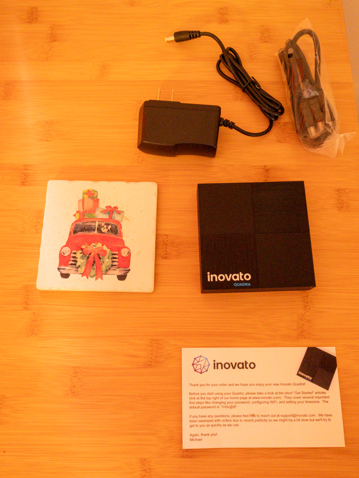

## First Impressions: 

Recently, I purchased an inovato quadra for an [octoprint](https://octoprint.org/) server. I had planned on using a RaspberryPi, but stock was nonexistent. I found inovato thanks to a recommendation from the [3d printing subreddit](https://www.reddit.com/r/3Dprinting/). Comparable performance to a Raspberry Pi 3, CPU max TDP 4W, and comes preloaded with Debian? Needless to say, I gave it a shot!

I've included pictures to give a sense of the scale and I'm blown away by the punch it packs! The inovato Quadra scored a [363 multi-core score in Geekbench 5](https://browser.geekbench.com/v5/cpu/17700617). Roughly 29% higher when compared to an [Oracle Cloud E2.1 Micro instance](https://browser.geekbench.com/v5/cpu/17742735). 

SSH is enabled out the box, so for my usecase I never needed to plug the inovato into a display. I simply plugged in an ethernet cable, powered it on, and checked my router for new clients. Took the default credentials and newly assigned IP address to my laptop's terminal and voila, I was in. 

## Alternatives:

### Oracle Cloud

That Oracle Cloud E2.1 Micro instance I mentioned earlier? That's included in the [Oracle Cloud Always Free tier](https://www.oracle.com/cloud/free/), so if cost is the #1 factor, that'll win almost any comparison. It includes a public IP, and makes more sense if you want to deploy and bring down the server with Terraform. The cloud is very appealing if you need a server for remote development, learning Linux, or serving a website.

### RaspberryPi

This is the Quadra's closest competitor, and unfortunately I've never owned a Pi. However, from my testing, I'm unable to get CPU usage beyond 20% for extended periods of time, or memory usage above 50%. Inovato themselves recommend opting for the Pi 4 if you plan on intensive tasks, but I've yet to run into one. I recommend the Quadra as long as prolonged video consumption isn't a planned usage. I've included a pricing table below from the inovato website, but honestly at the time of writing this I can't find a Pi 4 kit under $100. 

|               | Quadra     | Raspberry Pi |
|---------------|------------|--------------|
| Board         | $29.95     | $45+         |
| Case          | Included   | $6           |
| Heatsink      | Included   | $1           |
| SD Card       | Not Needed | $10          |
| HDMI Cable    | Included   | $6           |
| Power Adapter | Included   | $5           |
| Assembly      | Done       | Your time    |
| Total:        | $29.95     | $70+         |

## Strengths:

The inovato fills a niche for tasks that need to be completed on-site. Oracle Cloud VPS are incredible, but physically plugging one into my 3D printer for octoprint would be impossible. RaspberryPi 4 is difficult to obtain, and I don't see a need for the extra performance.  A few use cases I can think of where the inovato Quadra makes sense are listed below. 

*   Cheap Linux Desktop
*   Local Print Server
*   Local Plex/Kodi/Emby Server
*   Smart Mirror
*   Network Monitoring
*   Webcam stream with mjpg_streamer

## Closing Thoughts:

For $29, the inovato Quadra is an insane value in my eyes. It's fairly plug and play compared to competitor offerings, and quickly gets you into a Debian environment. At $29, you could have a kubernetes cluster of these for cheaper than the cost of one Raspberry Pi 4 kit. Consider Oracle Cloud's always free tier if your use case isn't on-premise.  

## Disclaimers:

[Tom Fenton in his article for Virtualization Review](https://virtualizationreview.com/articles/2022/10/12/quadra-part-2.aspx) stated his unit rebooted while watching videos and editing photos. A founder of inovato itself has confirmed as much in the [official forum](https://forum.inovato.com/post/how-does-it-compare-to-a-raspberry-pi-12449407). 

> Playing longer videos can make it shutdown due to heat. - Michael Burmeister-brown (inovato _Founder)_

I cannot speak to this issue, as it did not occur during my testing. My testing focused on the following, and the inovato handled all tasks without a reboot. 

*   Remote Hugo site development 
*   Remote Python Development 
*   Using OctoPrint to manage 6-8 hour prints
    *   Simultaneously using mjpg_streamer to capture timelapses of these prints with a connected webcam. 
*   Installing and upgrading various apt packages

> All images on this post were taken by Jason R

> This blog is not affiliated, associated, authorized, endorsed by, or in any way officially connected with Inovato LLC.